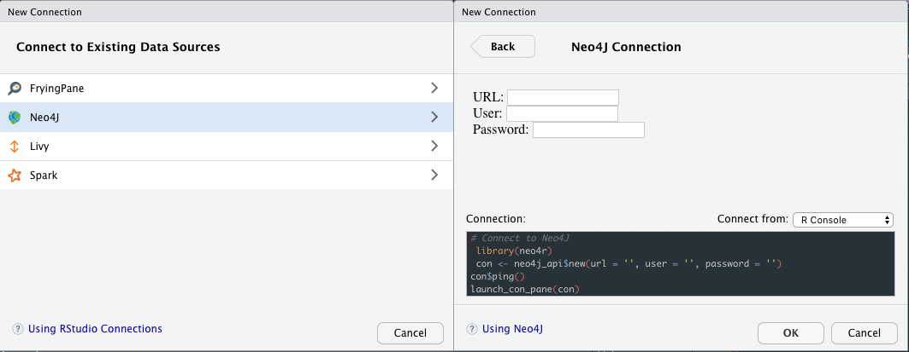

<!-- README.md is generated from README.Rmd. Please edit that file -->

[](https://travis-ci.org/statnmap/neo4r)

```{r setup, include = FALSE}
knitr::opts_chunk$set(
  collapse = TRUE,
  comment = "#>",
  fig.path = "man/figures/README-",
  out.width = "100%"
)

# library(neo4r)
# con <- neo4j_api$new(
#   url = "http://localhost:7474",
#   user = "neo4j", 
#   password = "pouetpouet"
#   )
#call_neo4j("MATCH (n) DETACH DELETE n", con)
#send_cypher("data-raw/create.cypher", con)

```

[](https://www.tidyverse.org/lifecycle/#experimental)

> Disclaimer: this package is still under active development. Read the [NEWS.md](NEWS.md) to be informed of the last changes.

Read complementary documentation at [https://neo4j-rstats.github.io/user-guide/](https://neo4j-rstats.github.io/user-guide/)

# neo4r

The goal of {neo4r} is to provide a modern and flexible Neo4J driver for R.

It's modern in the sense that the results are returned as tibbles whenever possible, it relies on modern tools, and it is designed to work with pipes. Our goal is to provide a driver that can be easily integrated in a data analysis workflow, especially by providing an API working smoothly with other data analysis (`{dplyr}` or `{purrr}`) and graph packages (`{igraph}`, `{ggraph}`, `{visNetwork}`...).

It's flexible in the sense that it is rather unopinionated regarding the way it returns the results, by trying to stay as close as possible to the way Neo4J returns data. That way, you have the control over the way you will compute the results. At the same time, the result is not too complex, so that the "heavy lifting" of data wrangling is not left to the user. 

The connexion object is also an easy to control R6 method, allowing you to update and query information from the API. 

## Server Connection 

Please note that __for now, the connection is only possible through http / https__.

## Installation

You can install {neo4r} from GitHub with:

```{r gh-installation, eval = FALSE}
# install.packages("remotes")
remotes::install_github("neo4j-rstats/neo4r")
```

## Create a connexion object 

Start by creating a new connexion object with `neo4j_api$new`

```{r}
library(neo4r)
con <- neo4j_api$new(url = "http://localhost:7474", 
                     user = "plop", password = "pouetpouet")
```

This connexion object is designed to interact with the Neo4J API. 

It comes with some methods to retrieve information from it : 

```{r}
# Test the endpoint, that will not work :
con$ping()
```

Being an R6 object, `con` is flexible in the sense that you can change `url`, `user` and `password` at any time:

```{r}
con$reset_user("neo4j")
con$reset_password("neo4j") 
con$ping()
```

That means you can connect to another url at any time without having to create a new connexion object. (`con$reset_url()`).

```{r}
# Get Neo4J Version
con$get_version()
# List constaints (if any)
con$get_constraints()
# Get a vector of labels (if any)
con$get_labels()
# Get a vector of relationships (if any)
con$get_relationships()
# Get schema 
con$get_schema()
```

### Using the Connection Pane

`{neo4r}` comes with a Connection Pane interface for RStudio. 

Once installed, you can go to the "Connections", and use the widget to connect to the Neo4J server: 



## Call the API

You can either create a separate query or insert it inside the `call_neo4j` function. 

The `call_neo4j()` function takes several arguments : 

+ `query` : the cypher query
+ `con` : the connexion object 
+ `type` : "rows" or "graph": whether to return the results as a list of results in tibble, or as a graph object (with `$nodes` and `$relationships`)
+ `output` : the output format (R or json) 
+ `include_stats` : whether or not to include the stats about the call 
+ `meta` : whether or not to include the meta arguments of the nodes when calling with "rows"

### "rows" format

The user chooses whether or not to return a list of tibbles when calling the API. You get as many objects as specified in the RETURN cypher statement. 

```{r}
library(magrittr)

'MATCH (r:record) -[:WAS_RECORDED] -> (b:Band) where b.formed = 1991 RETURN *;' %>%
  call_neo4j(con)
```

By default, results are returned as an R list of tibbles. We think this is the more "truthful" way to implement the outputs regarding Neo4J calls. 

For example, when you want to return two nodes types, you'll get two results, in the form of two tibbles (what we've seen just before) - the result is a two elements list with each element being labelled the way it has been specified in the Cypher query. 

Results can also be returned in JSON:

```{r}
'MATCH (r:record) -[:WAS_RECORDED] -> (b:Band) where b.formed = 1991 RETURN * LIMIT 1;' %>%
  call_neo4j(con, output = "json")
```

If you turn the `type` argument to `"graph"`, you'll get a graph result: 

```{r}
'MATCH (r:record) -[:WAS_RECORDED] -> (b:Band) where b.formed = 1991 RETURN *;' %>%
  call_neo4j(con, type = "graph")
```

The result is returned as one node or relationship by row. 

Due to the specific data format of Neo4J, there can be more than one label and property by node and relationship. That's why the results is returned, by design, as a list-dataframe. 

We have designed several functions to unnest the output : 

+`unnest_nodes()`, that can unnest a node dataframe : 

```{r}
res <- 'MATCH (r:record) -[w:WAS_RECORDED] -> (b:Band) where b.formed = 1991 RETURN *;' %>%
  call_neo4j(con, type = "graph")
unnest_nodes(res$nodes)
```

Please, note that this function will return `NA` for the properties that aren't in a node. For example here, we have no 'licence' information for the Maintainer node (that makes sense). 

On the long run, and this is not {neo4r} specific but Neo4J related, a good practice is to have a "name" propertie on each node, so this column will be full here.

Also, it is possible to unnest either the properties or the labels : 

```{r}
res$nodes %>%
  unnest_nodes(what = "properties")
```

```{r}
res$nodes %>%
  unnest_nodes(what = "label")
```

+ `unnest_relationships()`

There is only one nested column in the relationship table, thus the function is quite straightforward : 

```{r}
unnest_relationships(res$relationships)
```

+ `unnest_graph`

This function takes a graph results, and does `unnest_nodes` and `unnest_relationships`. 

```{r}
unnest_graph(res)
```

### Extraction 

There are two convenient functions to extract nodes and relationships: 

```{r}
'MATCH p=()-[r:WAS_RECORDED]->() RETURN p LIMIT 5;' %>%
  call_neo4j(con, type = "graph") %>% 
  extract_nodes()
```

```{r}
'MATCH p=()-[w:WAS_RECORDED]->() RETURN p LIMIT 5;' %>%
  call_neo4j(con, type = "graph") %>% 
  extract_relationships()
```

## Convert for common graph packages

### {igraph}

In order to be converted into a graph object:

+ The nodes should be a dataframe with the first column being a series of unique ID, understood as "names" by igraph - these are the ID columns from Neo4J. Other columns are considered attributes.  

+ relationships need a start and an end, *i.e.* startNode and endNode in the Neo4J results. 

Here how to create a graph object from a `{neo4r}` result:

```{r}
G <- "MATCH a=(p:Person {name: 'Tom Hanks'})-[r:ACTED_IN]->(m:Movie) RETURN a;" %>% 
  call_neo4j(con, type = "graph") 

library(dplyr)
library(purrr)
# Create a dataframe with col 1 being the ID, 
# And columns 2 being the names
G$nodes <- G$nodes %>%
  unnest_nodes(what = "properties") %>% 
  # We're extracting the first label of each node, but 
  # this column can also be removed if not needed
  mutate(label = map_chr(label, 1))
head(G$nodes)
```

We then reorder the relationnship table:

```{r}
G$relationships <- G$relationships %>%
  unnest_relationships() %>%
  select(startNode, endNode, type, everything())
head(G$relationships)
```

```{r}
graph_object <- igraph::graph_from_data_frame(
  d = G$relationships, 
  directed = TRUE, 
  vertices = G$nodes
)
plot(graph_object)
```


This can also be used with `{ggraph}` :

```{r}
library(ggraph)
graph_object %>%
  ggraph() + 
  geom_node_label(aes(label = label)) +
  geom_edge_link() + 
  theme_graph()
```

### {visNetwork}

`{visNetwork}` expects the following format : 

#### nodes	
- "id" : id of the node, needed in edges information
- "label" : label of the node
- "group" : group of the node. Groups can be configure with visGroups
- "value" : size of the node
- "title" : tooltip of the node

#### edges	
- "from" : node id of begin of the edge
- "to" : node id of end of the edge
- "label" : label of the edge
- "value" : size of the node
- "title" : tooltip of the node

(from `?visNetwork::visNetwork`).

`visNetwork` is smart enough to transform a list column into several label, so we don't have to worry too much about this one. 

Here's how to convert our `{neo4r}` result:

```{r eval = FALSE}
G <-"MATCH a=(p:Person {name: 'Tom Hanks'})-[r:ACTED_IN]->(m:Movie) RETURN a;" %>% 
  call_neo4j(con, type = "graph") 

# We'll just unnest the properties
G$nodes <- G$nodes %>%
  unnest_nodes(what = "properties")
head(G$nodes)  

# Turn the relationships :
G$relationships <- G$relationships %>%
  unnest_relationships() %>%
  select(from = startNode, to = endNode, label = type)
head(G$relationships)

visNetwork::visNetwork(G$nodes, G$relationships)
```


## Sending data to the API 

You can simply send queries has we have just seen, by writing the cypher query and call the api.  

### Transform elements to cypher queries

+ `vec_to_cypher()` creates a list : 

```{r}
vec_to_cypher(iris[1, 1:3], "Species")
```

+ and `vec_to_cypher_with_var()` creates a cypher call starting with a variable : 

```{r}
vec_to_cypher_with_var(iris[1, 1:3], "Species", a)
```

This can be combined inside a cypher call: 

```{r}
paste("MERGE", vec_to_cypher(iris[1, 1:3], "Species"))
```

### Reading and sending a cypher file :

+ `read_cypher` reads a cypher file and returns a tibble of all the calls:

```{r}
read_cypher("data-raw/create.cypher")
```

+ `send_cypher` reads a cypher file, and send it the the API. By default, the stats are returned. 

```{r eval = FALSE}
send_cypher("data-raw/constraints.cypher", con)
```

### Sending csv dataframe to Neo4J

The `load_csv` sends an csv from an url to the Neo4J browser. 

The args are : 

+ `on_load` : the code to execute on load 
+ `con` : the connexion object 
+ `url` : the url of the csv to send
+ `header` : whether or not the csv has a header
+ `periodic_commit` : the volume for PERIODIC COMMIT
+ `as` : the AS argument for LOAD CSV
+ `format` : the format of the result 
+ `include_stats` : whether or not to include the stats 
+ `meta` : whether or not to return the meta information

```{r eval = FALSE}
# Create the constraints
call_neo4j("CREATE CONSTRAINT ON (a:artist) ASSERT a.name IS UNIQUE;", con)
call_neo4j("CREATE CONSTRAINT ON (al:album) ASSERT al.name IS UNIQUE;", con)
```

```{r}
# List constaints (if any)
con$get_constraints()
# Create the query that will create the nodes and relationships
on_load_query <- 'MERGE (a:artist { name: csvLine.artist})
MERGE (al:album {name: csvLine.album_name})
MERGE (a) -[:has_recorded] -> (al)  
RETURN a AS artists, al AS albums;'
# Send the csv 
load_csv(url = "https://raw.githubusercontent.com/ThinkR-open/datasets/master/tracks.csv", 
         con = con, header = TRUE, periodic_commit = 50, 
         as = "csvLine", on_load = on_load_query)
```

## Sandboxing in Docker 

You can get an RStudio / Neo4J sandbox with Docker : 

```
docker pull colinfay/neo4r-docker
docker run -e PASSWORD=plop -e ROOT=TRUE -d -p 8787:8787 neo4r
```


## CoC 

Please note that this project is released with a [Contributor Code of Conduct](CODE_OF_CONDUCT.md).
By participating in this project you agree to abide by its terms.

```{r include = FALSE}
# system(glue::glue("docker stop {con_name}"))
```

