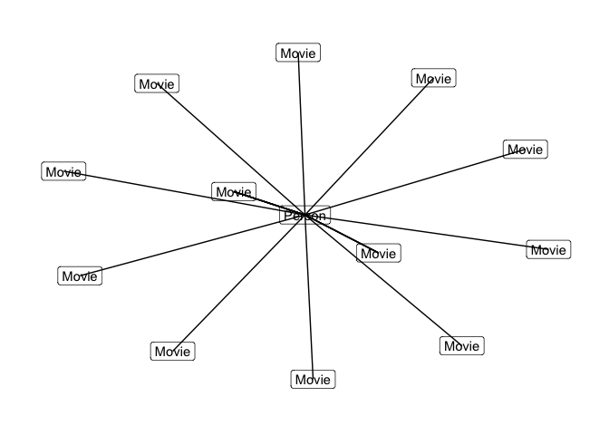

<!-- README.md is generated from README.Rmd. Please edit that file -->

[](https://travis-ci.org/statnmap/neo4r)

[](https://www.tidyverse.org/lifecycle/#experimental)

> Disclaimer: this package is still under active development. Read the
> [NEWS.md](NEWS.md) to be informed of the last changes.

Read complementary documentation at
<https://neo4j-rstats.github.io/user-guide/>

# neo4r

The goal of {neo4r} is to provide a modern and flexible Neo4J driver for
R.

It’s modern in the sense that the results are returned as tibbles
whenever possible, it relies on modern tools, and it is designed to work
with pipes. Our goal is to provide a driver that can be easily
integrated in a data analysis workflow, especially by providing an API
working smoothly with other data analysis (`{dplyr}` or `{purrr}`) and
graph packages (`{igraph}`, `{ggraph}`, `{visNetwork}`…).

It’s flexible in the sense that it is rather unopinionated regarding the
way it returns the results, by trying to stay as close as possible to
the way Neo4J returns data. That way, you have the control over the way
you will compute the results. At the same time, the result is not too
complex, so that the “heavy lifting” of data wrangling is not left to
the user.

The connexion object is also an easy to control R6 method, allowing you
to update and query information from the API.

## Server Connection

Please note that **for now, the connection is only possible through http
/ https**.

## Installation

You can install {neo4r} from GitHub with:

``` r
# install.packages("remotes")
remotes::install_github("neo4j-rstats/neo4r")
```

or from CRAN :

``` r
install.packages("neo4r")
```

## Create a connexion object

Start by creating a new connexion object with `neo4j_api$new`

``` r
library(neo4r)
con <- neo4j_api$new(
  url = "http://localhost:7474", 
  user = "neo4j", 
  password = "plop"
)
```

This connexion object is designed to interact with the Neo4J API.

It comes with some methods to retrieve information from it. `ping()`,
for example, tests if the endpoint is available.

``` r
# Test the endpoint, that will not work :
con$ping()
#> [1] 401
```

Being an R6 object, `con` is flexible in the sense that you can change
`url`, `user` and `password` at any time:

``` r
con$reset_user("neo4j")
con$reset_password("password") 
con$ping()
#> [1] 200
```

Other methods:

``` r
# Get Neo4J Version
con$get_version()
#> [1] "3.5.5"
# List constaints (if any)
con$get_constraints()
#> Null data.table (0 rows and 0 cols)
# Get a vector of labels (if any)
con$get_labels()
#> # A tibble: 0 x 1
#> # … with 1 variable: labels <chr>
# Get a vector of relationships (if any)
con$get_relationships()
#> # A tibble: 0 x 1
#> # … with 1 variable: labels <chr>
# Get index 
con$get_index()
#> Null data.table (0 rows and 0 cols)
```

## Call the API

You can either create a separate query or insert it inside the
`call_neo4j` function.

The `call_neo4j()` function takes several arguments :

  - `query` : the cypher query
  - `con` : the connexion object
  - `type` : “rows” or “graph”: whether to return the results as a list
    of results in tibble, or as a graph object (with `$nodes` and
    `$relationships`)
  - `output` : the output format (R or json)
  - `include_stats` : whether or not to include the stats about the call
  - `meta` : whether or not to include the meta arguments of the nodes
    when calling with “rows”

### The movie graph

Starting at version 0.1.3, the `play_movie()` function returns the full
cypher query to create the movie graph example from the Neo4J examples.

``` r
play_movies() %>%
  call_neo4j(con)
#> $a
#> # A tibble: 10 x 2
#>     born name     
#>    <int> <chr>    
#>  1  1956 Tom Hanks
#>  2  1956 Tom Hanks
#>  3  1956 Tom Hanks
#>  4  1956 Tom Hanks
#>  5  1956 Tom Hanks
#>  6  1956 Tom Hanks
#>  7  1956 Tom Hanks
#>  8  1956 Tom Hanks
#>  9  1956 Tom Hanks
#> 10  1956 Tom Hanks
#> 
#> $m
#> # A tibble: 10 x 3
#>    tagline                                         title           released
#>    <chr>                                           <chr>              <int>
#>  1 In every life there comes a time when that thi… That Thing You…     1996
#>  2 Once in a lifetime you get a chance to do some… A League of Th…     1992
#>  3 What if someone you never met, someone you nev… Sleepless in S…     1993
#>  4 A stiff drink. A little mascara. A lot of nerv… Charlie Wilson…     2007
#>  5 At the edge of the world, his journey begins.   Cast Away           2000
#>  6 Walk a mile youll never forget.                 The Green Mile      1999
#>  7 Break The Codes                                 The Da Vinci C…     2006
#>  8 This Holiday Season… Believe                    The Polar Expr…     2004
#>  9 A story of love, lava and burning desire.       Joe Versus the…     1990
#> 10 Everything is connected                         Cloud Atlas         2012
#> 
#> $d
#> # A tibble: 10 x 2
#>     born name                
#>    <int> <chr>               
#>  1  1956 Tom Hanks           
#>  2  1943 Penny Marshall      
#>  3  1941 Nora Ephron         
#>  4  1931 Mike Nichols        
#>  5  1951 Robert Zemeckis     
#>  6  1959 Frank Darabont      
#>  7  1954 Ron Howard          
#>  8  1951 Robert Zemeckis     
#>  9  1950 John Patrick Stanley
#> 10  1965 Tom Tykwer          
#> 
#> attr(,"class")
#> [1] "neo"  "list"
```

### “rows” format

The user chooses whether or not to return a list of tibbles when calling
the API. You get as many objects as specified in the RETURN cypher
statement.

``` r
library(magrittr)

'MATCH (tom {name: "Tom Hanks"}) RETURN tom;' %>%
  call_neo4j(con)
#> $tom
#> # A tibble: 1 x 2
#>    born name     
#>   <int> <chr>    
#> 1  1956 Tom Hanks
#> 
#> attr(,"class")
#> [1] "neo"  "list"

'MATCH (cloudAtlas {title: "Cloud Atlas"}) RETURN cloudAtlas;' %>%
  call_neo4j(con)
#> $cloudAtlas
#> # A tibble: 1 x 3
#>   tagline                 title       released
#>   <chr>                   <chr>          <int>
#> 1 Everything is connected Cloud Atlas     2012
#> 
#> attr(,"class")
#> [1] "neo"  "list"

"MATCH (people:Person)-[relatedTo]-(:Movie {title: 'Cloud Atlas'}) RETURN people.name, Type(relatedTo), relatedTo" %>%
  call_neo4j(con, type = 'row')
#> $people.name
#> # A tibble: 10 x 1
#>    value           
#>    <chr>           
#>  1 Tom Hanks       
#>  2 Jim Broadbent   
#>  3 David Mitchell  
#>  4 Tom Tykwer      
#>  5 Lana Wachowski  
#>  6 Stefan Arndt    
#>  7 Jessica Thompson
#>  8 Halle Berry     
#>  9 Hugo Weaving    
#> 10 Lilly Wachowski 
#> 
#> $`Type(relatedTo)`
#> # A tibble: 10 x 1
#>    value   
#>    <chr>   
#>  1 ACTED_IN
#>  2 ACTED_IN
#>  3 WROTE   
#>  4 DIRECTED
#>  5 DIRECTED
#>  6 PRODUCED
#>  7 REVIEWED
#>  8 ACTED_IN
#>  9 ACTED_IN
#> 10 DIRECTED
#> 
#> $relatedTo
#> # A tibble: 18 x 3
#>    roles     summary            rating
#>    <list>    <chr>               <int>
#>  1 <chr [1]> <NA>                   NA
#>  2 <chr [1]> <NA>                   NA
#>  3 <chr [1]> <NA>                   NA
#>  4 <chr [1]> <NA>                   NA
#>  5 <chr [1]> <NA>                   NA
#>  6 <chr [1]> <NA>                   NA
#>  7 <chr [1]> <NA>                   NA
#>  8 <NULL>    An amazing journey     95
#>  9 <chr [1]> <NA>                   NA
#> 10 <chr [1]> <NA>                   NA
#> 11 <chr [1]> <NA>                   NA
#> 12 <chr [1]> <NA>                   NA
#> 13 <chr [1]> <NA>                   NA
#> 14 <chr [1]> <NA>                   NA
#> 15 <chr [1]> <NA>                   NA
#> 16 <chr [1]> <NA>                   NA
#> 17 <chr [1]> <NA>                   NA
#> 18 <chr [1]> <NA>                   NA
#> 
#> attr(,"class")
#> [1] "neo"  "list"
```

By default, results are returned as an R list of tibbles. For example
here, `RETURN tom` will return a one element list, with object named
`tom`. We think this is the more “truthful” way to implement the outputs
regarding Neo4J calls.

When you want to return two nodes types, you’ll get two results, in the
form of two tibbles - the result is a two elements list with each
element being labelled the way it has been specified in the Cypher
query.

``` r
'MATCH (tom:Person {name: "Tom Hanks"})-[:ACTED_IN]->(tomHanksMovies) RETURN tom,tomHanksMovies' %>%
  call_neo4j(con)
#> $tom
#> # A tibble: 12 x 2
#>     born name     
#>    <int> <chr>    
#>  1  1956 Tom Hanks
#>  2  1956 Tom Hanks
#>  3  1956 Tom Hanks
#>  4  1956 Tom Hanks
#>  5  1956 Tom Hanks
#>  6  1956 Tom Hanks
#>  7  1956 Tom Hanks
#>  8  1956 Tom Hanks
#>  9  1956 Tom Hanks
#> 10  1956 Tom Hanks
#> 11  1956 Tom Hanks
#> 12  1956 Tom Hanks
#> 
#> $tomHanksMovies
#> # A tibble: 12 x 3
#>    tagline                                         title           released
#>    <chr>                                           <chr>              <int>
#>  1 Houston, we have a problem.                     Apollo 13           1995
#>  2 At odds in life... in love on-line.             Youve Got Mail      1998
#>  3 Once in a lifetime you get a chance to do some… A League of Th…     1992
#>  4 A story of love, lava and burning desire.       Joe Versus the…     1990
#>  5 In every life there comes a time when that thi… That Thing You…     1996
#>  6 Break The Codes                                 The Da Vinci C…     2006
#>  7 Everything is connected                         Cloud Atlas         2012
#>  8 At the edge of the world, his journey begins.   Cast Away           2000
#>  9 Walk a mile youll never forget.                 The Green Mile      1999
#> 10 What if someone you never met, someone you nev… Sleepless in S…     1993
#> 11 This Holiday Season… Believe                    The Polar Expr…     2004
#> 12 A stiff drink. A little mascara. A lot of nerv… Charlie Wilson…     2007
#> 
#> attr(,"class")
#> [1] "neo"  "list"
```

Results can also be returned in JSON, for example for writing to a file:

``` r
tmp <- tempfile(fileext = ".json")
'MATCH (people:Person) RETURN people.name LIMIT 1' %>%
  call_neo4j(con, output = "json") %>%
  write(tmp)
jsonlite::read_json(tmp)
#> [[1]]
#> [[1]][[1]]
#> [[1]][[1]]$row
#> [[1]][[1]]$row[[1]]
#> [[1]][[1]]$row[[1]][[1]]
#> [1] "Keanu Reeves"
#> 
#> 
#> 
#> [[1]][[1]]$meta
#> [[1]][[1]]$meta[[1]]
#> named list()
```

If you turn the `type` argument to `"graph"`, you’ll get a graph
result:

``` r
'MATCH (tom:Person {name: "Tom Hanks"})-[act:ACTED_IN]->(tomHanksMovies) RETURN act,tom,tomHanksMovies' %>%
  call_neo4j(con, type = "graph")
#> $nodes
#> # A tibble: 13 x 3
#>    id    label     properties
#>    <chr> <list>    <list>    
#>  1 144   <chr [1]> <list [3]>
#>  2 71    <chr [1]> <list [2]>
#>  3 67    <chr [1]> <list [3]>
#>  4 162   <chr [1]> <list [3]>
#>  5 78    <chr [1]> <list [3]>
#>  6 85    <chr [1]> <list [3]>
#>  7 111   <chr [1]> <list [3]>
#>  8 105   <chr [1]> <list [3]>
#>  9 150   <chr [1]> <list [3]>
#> 10 130   <chr [1]> <list [3]>
#> 11 73    <chr [1]> <list [3]>
#> 12 161   <chr [1]> <list [3]>
#> 13 159   <chr [1]> <list [3]>
#> 
#> $relationships
#> # A tibble: 12 x 5
#>    id    type     startNode endNode properties
#>    <chr> <chr>    <chr>     <chr>   <list>    
#>  1 202   ACTED_IN 71        144     <list [1]>
#>  2 84    ACTED_IN 71        67      <list [1]>
#>  3 234   ACTED_IN 71        162     <list [1]>
#>  4 98    ACTED_IN 71        78      <list [1]>
#>  5 110   ACTED_IN 71        85      <list [1]>
#>  6 146   ACTED_IN 71        111     <list [1]>
#>  7 137   ACTED_IN 71        105     <list [1]>
#>  8 213   ACTED_IN 71        150     <list [1]>
#>  9 182   ACTED_IN 71        130     <list [1]>
#> 10 91    ACTED_IN 71        73      <list [1]>
#> 11 232   ACTED_IN 71        161     <list [1]>
#> 12 228   ACTED_IN 71        159     <list [1]>
#> 
#> attr(,"class")
#> [1] "neo"  "list"
```

The result is returned as one node or relationship by row.

Due to the specific data format of Neo4J, there can be more than one
label and property by node and relationship. That’s why the results is
returned, by design, as a list-dataframe.

We have designed several functions to unnest the output :

\+`unnest_nodes()`, that can unnest a node dataframe
:

``` r
res <- 'MATCH (tom:Person {name:"Tom Hanks"})-[a:ACTED_IN]->(m)<-[:ACTED_IN]-(coActors) RETURN m AS acted,coActors.name' %>%
  call_neo4j(con, type = "graph")
unnest_nodes(res$nodes)
#> # A tibble: 11 x 5
#>    id    value tagline                                title        released
#>    <chr> <chr> <chr>                                  <chr>           <int>
#>  1 144   Movie Houston, we have a problem.            Apollo 13        1995
#>  2 67    Movie At odds in life... in love on-line.    Youve Got M…     1998
#>  3 162   Movie Once in a lifetime you get a chance t… A League of…     1992
#>  4 78    Movie A story of love, lava and burning des… Joe Versus …     1990
#>  5 85    Movie In every life there comes a time when… That Thing …     1996
#>  6 111   Movie Break The Codes                        The Da Vinc…     2006
#>  7 105   Movie Everything is connected                Cloud Atlas      2012
#>  8 150   Movie At the edge of the world, his journey… Cast Away        2000
#>  9 130   Movie Walk a mile youll never forget.        The Green M…     1999
#> 10 73    Movie What if someone you never met, someon… Sleepless i…     1993
#> 11 159   Movie A stiff drink. A little mascara. A lo… Charlie Wil…     2007
```

Please, note that this function will return `NA` for the properties that
aren’t in a node.

Also, it is possible to unnest either the properties or the labels :

``` r
res %>%
  extract_nodes() %>%
  unnest_nodes(what = "properties")
#> # A tibble: 11 x 5
#>    id    label   tagline                              title        released
#>    <chr> <list>  <chr>                                <chr>           <int>
#>  1 144   <chr [… Houston, we have a problem.          Apollo 13        1995
#>  2 67    <chr [… At odds in life... in love on-line.  Youve Got M…     1998
#>  3 162   <chr [… Once in a lifetime you get a chance… A League of…     1992
#>  4 78    <chr [… A story of love, lava and burning d… Joe Versus …     1990
#>  5 85    <chr [… In every life there comes a time wh… That Thing …     1996
#>  6 111   <chr [… Break The Codes                      The Da Vinc…     2006
#>  7 105   <chr [… Everything is connected              Cloud Atlas      2012
#>  8 150   <chr [… At the edge of the world, his journ… Cast Away        2000
#>  9 130   <chr [… Walk a mile youll never forget.      The Green M…     1999
#> 10 73    <chr [… What if someone you never met, some… Sleepless i…     1993
#> 11 159   <chr [… A stiff drink. A little mascara. A … Charlie Wil…     2007
```

``` r
res %>%
  extract_nodes() %>%
  unnest_nodes(what = "label")
#> # A tibble: 11 x 3
#>    id    properties value
#>    <chr> <list>     <chr>
#>  1 144   <list [3]> Movie
#>  2 67    <list [3]> Movie
#>  3 162   <list [3]> Movie
#>  4 78    <list [3]> Movie
#>  5 85    <list [3]> Movie
#>  6 111   <list [3]> Movie
#>  7 105   <list [3]> Movie
#>  8 150   <list [3]> Movie
#>  9 130   <list [3]> Movie
#> 10 73    <list [3]> Movie
#> 11 159   <list [3]> Movie
```

  - `unnest_relationships()`

There is only one nested column in the relationship table, thus the
function is quite straightforward
:

``` r
'MATCH (people:Person)-[relatedTo]-(:Movie {title: "Cloud Atlas"}) RETURN people.name, Type(relatedTo), relatedTo' %>%
  call_neo4j(con, type = "graph") %>%
  extract_relationships() %>%
  unnest_relationships()
#> # A tibble: 23 x 8
#>    id    type     startNode endNode roles     value summary rating
#>    <chr> <chr>    <chr>     <chr>   <list>    <lgl> <chr>    <int>
#>  1 137   ACTED_IN 71        105     <chr [1]> NA    <NA>        NA
#>  2 137   ACTED_IN 71        105     <chr [1]> NA    <NA>        NA
#>  3 137   ACTED_IN 71        105     <chr [1]> NA    <NA>        NA
#>  4 137   ACTED_IN 71        105     <chr [1]> NA    <NA>        NA
#>  5 140   ACTED_IN 107       105     <chr [1]> NA    <NA>        NA
#>  6 140   ACTED_IN 107       105     <chr [1]> NA    <NA>        NA
#>  7 140   ACTED_IN 107       105     <chr [1]> NA    <NA>        NA
#>  8 144   WROTE    109       105     <NULL>    NA    <NA>        NA
#>  9 141   DIRECTED 108       105     <NULL>    NA    <NA>        NA
#> 10 143   DIRECTED 6         105     <NULL>    NA    <NA>        NA
#> # … with 13 more rows
```

Note that `unnest_relationships()` only does one level of unnesting.

  - `unnest_graph`

This function takes a graph results, and does `unnest_nodes` and
`unnest_relationships`.

``` r
'MATCH (people:Person)-[relatedTo]-(:Movie {title: "Cloud Atlas"}) RETURN people.name, Type(relatedTo), relatedTo' %>%
  call_neo4j(con, type = "graph") %>%
  unnest_graph()
#> $nodes
#> # A tibble: 11 x 7
#>    id    value   born name           tagline             title     released
#>    <chr> <chr>  <int> <chr>          <chr>               <chr>        <int>
#>  1 71    Person  1956 Tom Hanks      <NA>                <NA>            NA
#>  2 105   Movie     NA <NA>           Everything is conn… Cloud At…     2012
#>  3 107   Person  1949 Jim Broadbent  <NA>                <NA>            NA
#>  4 109   Person  1969 David Mitchell <NA>                <NA>            NA
#>  5 108   Person  1965 Tom Tykwer     <NA>                <NA>            NA
#>  6 6     Person  1965 Lana Wachowski <NA>                <NA>            NA
#>  7 110   Person  1961 Stefan Arndt   <NA>                <NA>            NA
#>  8 169   Person    NA Jessica Thomp… <NA>                <NA>            NA
#>  9 106   Person  1966 Halle Berry    <NA>                <NA>            NA
#> 10 4     Person  1960 Hugo Weaving   <NA>                <NA>            NA
#> 11 5     Person  1967 Lilly Wachows… <NA>                <NA>            NA
#> 
#> $relationships
#> # A tibble: 23 x 8
#>    id    type     startNode endNode roles     value summary rating
#>    <chr> <chr>    <chr>     <chr>   <list>    <lgl> <chr>    <int>
#>  1 137   ACTED_IN 71        105     <chr [1]> NA    <NA>        NA
#>  2 137   ACTED_IN 71        105     <chr [1]> NA    <NA>        NA
#>  3 137   ACTED_IN 71        105     <chr [1]> NA    <NA>        NA
#>  4 137   ACTED_IN 71        105     <chr [1]> NA    <NA>        NA
#>  5 140   ACTED_IN 107       105     <chr [1]> NA    <NA>        NA
#>  6 140   ACTED_IN 107       105     <chr [1]> NA    <NA>        NA
#>  7 140   ACTED_IN 107       105     <chr [1]> NA    <NA>        NA
#>  8 144   WROTE    109       105     <NULL>    NA    <NA>        NA
#>  9 141   DIRECTED 108       105     <NULL>    NA    <NA>        NA
#> 10 143   DIRECTED 6         105     <NULL>    NA    <NA>        NA
#> # … with 13 more rows
#> 
#> attr(,"class")
#> [1] "neo"  "list"
```

### Extraction

There are two convenient functions to extract nodes and
relationships:

``` r
'MATCH (bacon:Person {name:"Kevin Bacon"})-[*1..4]-(hollywood) RETURN DISTINCT hollywood' %>%
  call_neo4j(con, type = "graph") %>% 
  extract_nodes()
#> # A tibble: 135 x 3
#>    id    label     properties
#>    <chr> <list>    <list>    
#>  1 72    <chr [1]> <list [2]>
#>  2 68    <chr [1]> <list [2]>
#>  3 54    <chr [1]> <list [2]>
#>  4 34    <chr [1]> <list [2]>
#>  5 70    <chr [1]> <list [2]>
#>  6 69    <chr [1]> <list [2]>
#>  7 67    <chr [1]> <list [3]>
#>  8 163   <chr [1]> <list [2]>
#>  9 166   <chr [1]> <list [2]>
#> 10 77    <chr [1]> <list [2]>
#> # … with 125 more rows
```

``` r
'MATCH p=shortestPath(
  (bacon:Person {name:"Kevin Bacon"})-[*]-(meg:Person {name:"Meg Ryan"})
)
RETURN p' %>%
  call_neo4j(con, type = "graph") %>% 
  extract_relationships()
#> # A tibble: 4 x 5
#>   id    type     startNode endNode properties
#>   <chr> <chr>    <chr>     <chr>   <list>    
#> 1 202   ACTED_IN 71        144     <list [1]>
#> 2 203   ACTED_IN 19        144     <list [1]>
#> 3 91    ACTED_IN 71        73      <list [1]>
#> 4 92    ACTED_IN 34        73      <list [1]>
```

## Convert for common graph packages

### {igraph}

In order to be converted into a graph object:

  - The nodes should be a dataframe with the first column being a series
    of unique ID, understood as “names” by igraph - these are the ID
    columns from Neo4J. Other columns are considered attributes.

  - relationships need a start and an end, *i.e.* startNode and endNode
    in the Neo4J results.

Here how to create a graph object from a `{neo4r}`
result:

``` r
G <- "MATCH a=(p:Person {name: 'Tom Hanks'})-[r:ACTED_IN]->(m:Movie) RETURN a;" %>% 
  call_neo4j(con, type = "graph") 

library(dplyr)
#> 
#> Attaching package: 'dplyr'
#> The following objects are masked from 'package:stats':
#> 
#>     filter, lag
#> The following objects are masked from 'package:base':
#> 
#>     intersect, setdiff, setequal, union
library(purrr)
#> 
#> Attaching package: 'purrr'
#> The following object is masked from 'package:magrittr':
#> 
#>     set_names
# Create a dataframe with col 1 being the ID, 
# And columns 2 being the names
G$nodes <- G$nodes %>%
  unnest_nodes(what = "properties") %>% 
  # We're extracting the first label of each node, but 
  # this column can also be removed if not needed
  mutate(label = map_chr(label, 1))
head(G$nodes)
#> # A tibble: 6 x 7
#>   id    label  tagline                     title      released  born name  
#>   <chr> <chr>  <chr>                       <chr>         <int> <int> <chr> 
#> 1 144   Movie  Houston, we have a problem. Apollo 13      1995    NA <NA>  
#> 2 71    Person <NA>                        <NA>             NA  1956 Tom H…
#> 3 67    Movie  At odds in life... in love… Youve Got…     1998    NA <NA>  
#> 4 162   Movie  Once in a lifetime you get… A League …     1992    NA <NA>  
#> 5 78    Movie  A story of love, lava and … Joe Versu…     1990    NA <NA>  
#> 6 85    Movie  In every life there comes … That Thin…     1996    NA <NA>
```

We then reorder the relationnship table:

``` r
G$relationships <- G$relationships %>%
  unnest_relationships() %>%
  select(startNode, endNode, type, everything()) %>%
  mutate(roles = unlist(roles))
head(G$relationships)
#> # A tibble: 6 x 5
#>   startNode endNode type     id    roles             
#>   <chr>     <chr>   <chr>    <chr> <chr>             
#> 1 71        144     ACTED_IN 202   Jim Lovell        
#> 2 71        67      ACTED_IN 84    Joe Fox           
#> 3 71        162     ACTED_IN 234   Jimmy Dugan       
#> 4 71        78      ACTED_IN 98    Joe Banks         
#> 5 71        85      ACTED_IN 110   Mr. White         
#> 6 71        111     ACTED_IN 146   Dr. Robert Langdon
```

``` r
graph_object <- igraph::graph_from_data_frame(
  d = G$relationships, 
  directed = TRUE, 
  vertices = G$nodes
)
plot(graph_object)
```


This can also be used with `{ggraph}` :

``` r
library(ggraph)
#> Loading required package: ggplot2
graph_object %>%
  ggraph() + 
  geom_node_label(aes(label = label)) +
  geom_edge_link() + 
  theme_graph()
#> Using `nicely` as default layout
```



### {visNetwork}

`{visNetwork}` expects the following format :

#### nodes

  - “id” : id of the node, needed in edges information
  - “label” : label of the node
  - “group” : group of the node. Groups can be configure with visGroups
  - “value” : size of the node
  - “title” : tooltip of the node

#### edges

  - “from” : node id of begin of the edge
  - “to” : node id of end of the edge
  - “label” : label of the edge
  - “value” : size of the node
  - “title” : tooltip of the node

(from `?visNetwork::visNetwork`).

`visNetwork` is smart enough to transform a list column into several
label, so we don’t have to worry too much about this one.

Here’s how to convert our `{neo4r}`
result:

``` r
G <-"MATCH a=(p:Person {name: 'Tom Hanks'})-[r:ACTED_IN]->(m:Movie) RETURN a;" %>% 
  call_neo4j(con, type = "graph") 

# We'll just unnest the properties
G$nodes <- G$nodes %>%
  unnest_nodes(what = "properties")
head(G$nodes)  

# Turn the relationships :
G$relationships <- G$relationships %>%
  unnest_relationships() %>%
  select(from = startNode, to = endNode, label = type)
head(G$relationships)

visNetwork::visNetwork(G$nodes, G$relationships)
```

## Sending data to the API

You can simply send queries has we have just seen, by writing the cypher
query and call the api.

### Transform elements to cypher queries

  - `vec_to_cypher()` creates a list :

<!-- end list -->

``` r
vec_to_cypher(iris[1, 1:3], "Species")
#> [1] "(:`Species` {`Sepal.Length`: '5.1', `Sepal.Width`: '3.5', `Petal.Length`: '1.4'})"
```

  - and `vec_to_cypher_with_var()` creates a cypher call starting with a
    variable :

<!-- end list -->

``` r
vec_to_cypher_with_var(iris[1, 1:3], "Species", a)
#> [1] "(a:`Species` {`Sepal.Length`: '5.1', `Sepal.Width`: '3.5', `Petal.Length`: '1.4'})"
```

This can be combined inside a cypher call:

``` r
paste("MERGE", vec_to_cypher(iris[1, 1:3], "Species"))
#> [1] "MERGE (:`Species` {`Sepal.Length`: '5.1', `Sepal.Width`: '3.5', `Petal.Length`: '1.4'})"
```

### Reading and sending a cypher file :

  - `read_cypher` reads a cypher file and returns a tibble of all the
    calls:

<!-- end list -->

``` r
read_cypher("data-raw/create.cypher")
#> # A tibble: 4 x 1
#>   cypher                                                                   
#>   <chr>                                                                    
#> 1 CREATE CONSTRAINT ON (b:Band) ASSERT b.name IS UNIQUE;                   
#> 2 CREATE CONSTRAINT ON (c:City) ASSERT c.name IS UNIQUE;                   
#> 3 CREATE CONSTRAINT ON (r:record) ASSERT r.name IS UNIQUE;                 
#> 4 CREATE (ancient:Band {name: 'Ancient', formed: 1992}), (acturus:Band {na…
```

  - `send_cypher` reads a cypher file, and send it the the API. By
    default, the stats are returned.

<!-- end list -->

``` r
send_cypher("data-raw/constraints.cypher", con)
#> No data returned.
#> No data returned.
#> No data returned.
#> [[1]]
#> # A tibble: 12 x 2
#>    type                  value
#>    <chr>                 <dbl>
#>  1 contains_updates          1
#>  2 nodes_created             0
#>  3 nodes_deleted             0
#>  4 properties_set            0
#>  5 relationships_created     0
#>  6 relationship_deleted      0
#>  7 labels_added              0
#>  8 labels_removed            0
#>  9 indexes_added             0
#> 10 indexes_removed           0
#> 11 constraints_added         1
#> 12 constraints_removed       0
#> 
#> [[2]]
#> # A tibble: 12 x 2
#>    type                  value
#>    <chr>                 <dbl>
#>  1 contains_updates          1
#>  2 nodes_created             0
#>  3 nodes_deleted             0
#>  4 properties_set            0
#>  5 relationships_created     0
#>  6 relationship_deleted      0
#>  7 labels_added              0
#>  8 labels_removed            0
#>  9 indexes_added             0
#> 10 indexes_removed           0
#> 11 constraints_added         1
#> 12 constraints_removed       0
#> 
#> [[3]]
#> # A tibble: 12 x 2
#>    type                  value
#>    <chr>                 <dbl>
#>  1 contains_updates          1
#>  2 nodes_created             0
#>  3 nodes_deleted             0
#>  4 properties_set            0
#>  5 relationships_created     0
#>  6 relationship_deleted      0
#>  7 labels_added              0
#>  8 labels_removed            0
#>  9 indexes_added             0
#> 10 indexes_removed           0
#> 11 constraints_added         1
#> 12 constraints_removed       0
```

### Sending csv dataframe to Neo4J

The `load_csv` sends an csv from an url to the Neo4J browser.

The args are :

  - `on_load` : the code to execute on load
  - `con` : the connexion object
  - `url` : the url of the csv to send
  - `header` : whether or not the csv has a header
  - `periodic_commit` : the volume for PERIODIC COMMIT
  - `as` : the AS argument for LOAD CSV
  - `format` : the format of the result
  - `include_stats` : whether or not to include the stats
  - `meta` : whether or not to return the meta information

Let’s use Neo4J `northwind-graph` example for that.

``` r
# Create the query that will create the nodes and relationships
on_load_query <- 'CREATE (n:Product)
  SET n = row,
  n.unitPrice = toFloat(row.unitPrice),
  n.unitsInStock = toInteger(row.unitsInStock), n.unitsOnOrder = toInteger(row.unitsOnOrder),
  n.reorderLevel = toInteger(row.reorderLevel), n.discontinued = (row.discontinued <> "0");'
# Send the csv 
load_csv(url = "http://data.neo4j.com/northwind/products.csv", 
         con = con, header = TRUE, periodic_commit = 50, 
         as = "row", on_load = on_load_query)
#> No data returned.
#> # A tibble: 12 x 2
#>    type                  value
#>    <chr>                 <dbl>
#>  1 contains_updates          1
#>  2 nodes_created            77
#>  3 nodes_deleted             0
#>  4 properties_set         1155
#>  5 relationships_created     0
#>  6 relationship_deleted      0
#>  7 labels_added             77
#>  8 labels_removed            0
#>  9 indexes_added             0
#> 10 indexes_removed           0
#> 11 constraints_added         0
#> 12 constraints_removed       0
```

### Using the Connection Pane

`{neo4r}` comes with a Connection Pane interface for RStudio.

Once installed, you can go to the “Connections”, and use the widget to
connect to the Neo4J server:


## Sandboxing in Docker

You can get an RStudio / Neo4J sandbox with Docker :

    docker pull colinfay/neo4r-docker
    docker run -e PASSWORD=plop -e ROOT=TRUE -d -p 8787:8787 neo4r

## CoC

Please note that this project is released with a [Contributor Code of
Conduct](CODE_OF_CONDUCT.md). By participating in this project you agree
to abide by its terms.
