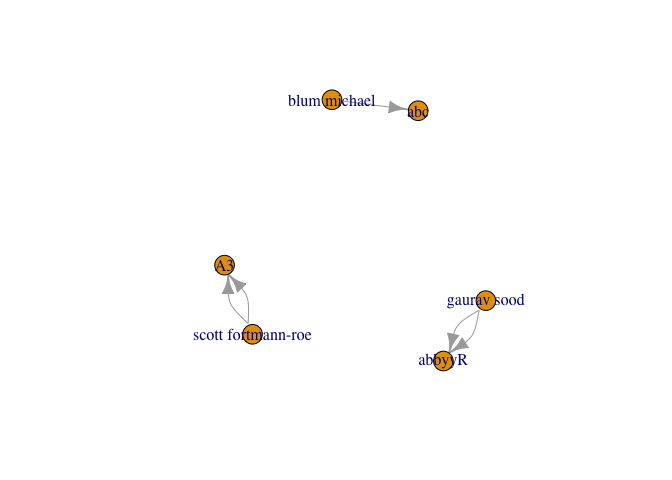

<!-- README.md is generated from README.Rmd. Please edit that file -->

[](https://www.tidyverse.org/lifecycle/#experimental)

> Disclaimer: this package is still at an experimental level and under
> active development. You should only use it for testing, reporting bugs
> (which are to be expected), proposing changes to the code, requesting
> features, sending ideas… As long as this package is in “Experimental”
> mode, there might be bugs, and changes to the API are to be expected.
> Read the [NEWS.md](NEWS.md) to be informed of the last changes.

# neo4r

The goal of {neo4r} is to provide a modern and flexible Neo4J driver for
R.

It’s modern in the sense that you results are returned as tibbles
whenever possible, relies on modern tools, and is designed to work with
the pipe. Our goal with this package is to provide a driver that can be
easily integrated in a data analysis workflow, especially by providing
an API that can work smoothly with other data analysis (dplyr or purrr)
and graph packages (igraph, ggraph, visNetwork…).

It’s flexible in the sense that it is rather unopinionated regarding the
way it returns the results, by trying to stay as close as possible to
the way Neo4J returns data. That way, you have the control over the way
you will compute the results. At the same time, the result is not too
complex, so that the “heavy lifting” of data wrangling is not left to
the user.

The connexion object is also an easy to control R6 method, allowing you
to update and query information from the API.

## Installation

You can install {neo4r} from GitHub with:

``` r
# install.packages("devtools")
devtools::install_github("neo4j-rstats/neo4r")
```

## Create a connexion object

Start by creating a new connexion object with `neo4j_api$new`

``` r
library(neo4r)
con <- neo4j_api$new(url = "http://localhost:7474", 
                     user = "plop", password = "pouetpouet")
```

This connexion object is designed to interact with you Neo4J API.

It comes with some methods to retrieve information from it :

``` r
# Test the endpoint, that will not work :
con$ping()
#> [1] 401
```

Being an R6 object, `con` is flexible in the sense that you can change
`url`, `user` and `password` at any time:

``` r
con$reset_user("neo4j")
con$ping()
#> [1] 200
# Or with 
con$password <- "pouetpouet"
```

That means you can at any time connect to another url without having to
generate a new connexion object. (`con$reset_url()`).

``` r
# Get Neo4J Version
con$get_version()
#> [1] "3.3.3"
# List constaints (if any)
con$get_constraints()
#> # A tibble: 6 x 3
#>   label      type       property_keys
#>   <chr>      <chr>      <chr>        
#> 1 setosa     UNIQUENESS Species      
#> 2 Maintainer UNIQUENESS name         
#> 3 Package    UNIQUENESS name         
#> 4 Author     UNIQUENESS name         
#> 5 artist     UNIQUENESS name         
#> 6 album      UNIQUENESS name
# Get a vector of labels (if any)
con$get_labels()
#> # A tibble: 6 x 1
#>   labels    
#>   <chr>     
#> 1 album     
#> 2 setosa    
#> 3 Author    
#> 4 Package   
#> 5 Maintainer
#> 6 artist
# Get a vector of relationships (if any)
con$get_relationships()
#> # A tibble: 4 x 1
#>   relationships
#>   <chr>        
#> 1 MAINTAINS    
#> 2 DEPENDS_ON   
#> 3 IMPORTS      
#> 4 has_recorded
# Get schema 
con$get_schema()
#> # A tibble: 6 x 2
#>   label      property_keys
#>   <chr>      <chr>        
#> 1 Package    name         
#> 2 album      name         
#> 3 setosa     Species      
#> 4 Author     name         
#> 5 artist     name         
#> 6 Maintainer name
```

## Call the API

You can either create a separate query or insert it inside the
`call_api` function.

The `call_api` function takes several arguments :

  - query : the cypher query
  - con : the connexion object
  - type : “rows” or “graph”: wether to return the results as a list of
    results in tibble, or as a graph object (with `$nodes` and
    `$relationships`)
  - output : the output format (r or json)
  - include\_stats : whether or not to include the stats about the call
  - meta : wether or not to include the meta arguments of the nodes when
    calling with “rows”

> At the end of the developping process of all the packages planned, you
> will be able to write your queries and pipe them with {cyphersugar},
> which offers a syntactic sugar on top of cypher.

### “rows” format

When you’re calling the API, you can choose to returns a list of
tibbles. You get as many objects as you specified in the RETURN cypher
statement.

``` r
library(magrittr)

'MATCH (p:Package) RETURN p.name AS nom LIMIT 5' %>%
  call_api(con)
#> $nom
#> # A tibble: 5 x 1
#>   value   
#>   <chr>   
#> 1 A3      
#> 2 abbyyR  
#> 3 abc     
#> 4 abc.data
#> 5 ABC.RAP
```

By default, results are returned as an R list of tibbles. We choose to
implement it this way, as we think this is the more “truthful” regarding
the way you call Neo4J.

For example, when you want to return two nodes, you’ll get two results,
in the form of two tibbles (p.name and dep.name
here):

``` r
'MATCH (p:Package) <-[:DEPENDS_ON]-(dep:Package) RETURN p.name AS nom, dep.name AS maintainer LIMIT 5' %>%
  call_api(con)
#> $nom
#> # A tibble: 5 x 1
#>   value
#>   <chr>
#> 1 abind
#> 2 abind
#> 3 abind
#> 4 abind
#> 5 ade4 
#> 
#> $maintainer
#> # A tibble: 5 x 1
#>   value   
#>   <chr>   
#> 1 multipol
#> 2 Bagidis 
#> 3 multipol
#> 4 Bagidis 
#> 5 subniche
```

The result is a two elements list with each element being labelled as
what you specified in the cypher query.

Results can also be returned in
JSON:

``` r
'MATCH (p:Package) <-[:DEPENDS_ON]-(dep:Package) RETURN p.name AS nom, dep.name AS maintainer LIMIT 1' %>%
  call_api(con, output = "json")
#> [
#>   [
#>     {
#>       "row": [
#>         ["abind"],
#>         ["multipol"]
#>       ],
#>       "meta": [
#>         {},
#>         {}
#>       ]
#>     }
#>   ]
#> ]
```

If you turn the `type` argument to `graph`, you’ll get a graph result:

``` r
'MATCH p=()-[r:MAINTAINS]->() RETURN p LIMIT 5' %>%
  call_api(con, type = "graph")
#> $nodes
#> # A tibble: 6 x 3
#>   id    label     properties
#>   <chr> <list>    <list>    
#> 1 0     <chr [1]> <list [5]>
#> 2 1     <chr [1]> <list [1]>
#> 3 2     <chr [1]> <list [5]>
#> 4 3     <chr [1]> <list [1]>
#> 5 4     <chr [1]> <list [5]>
#> 6 5     <chr [1]> <list [1]>
#> 
#> $relationships
#> # A tibble: 5 x 5
#>   id    type      startNode endNode properties
#>   <chr> <chr>     <chr>     <chr>   <list>    
#> 1 16713 MAINTAINS 1         0       <list [0]>
#> 2 0     MAINTAINS 1         0       <list [0]>
#> 3 16714 MAINTAINS 3         2       <list [0]>
#> 4 1     MAINTAINS 3         2       <list [0]>
#> 5 16715 MAINTAINS 5         4       <list [0]>
#> 
#> attr(,"class")
#> [1] "neo"  "list"
```

The result is returned as one node or relationship by row.

Due to the specific data format of Neo4J, there can be more than one
label and propertie by node and relationship. That’s why the results is
returned, by design, as a list-data.frame.

We have designed several functions to unnest this :

  - #### unnest\_nodes, that can unnest a node dataframe :

<!-- end list -->

``` r
res <- 'MATCH p=()-[r:MAINTAINS]->() RETURN p LIMIT 5' %>%
  call_api(con, type = "graph")
unnest_nodes(res$nodes)
#> # A tibble: 6 x 7
#>   id    label      date       license            name   title      version
#>   <chr> <chr>      <chr>      <chr>              <chr>  <chr>      <chr>  
#> 1 0     Package    2015-08-15 GPL (>= 2)         A3     "Accurate… 1.0.0  
#> 2 1     Maintainer <NA>       <NA>               scott… <NA>       <NA>   
#> 3 2     Package    NA         MIT + file LICENSE abbyyR Access to… 0.5.1  
#> 4 3     Maintainer <NA>       <NA>               gaura… <NA>       <NA>   
#> 5 4     Package    2015-05-04 GPL (>= 3)         abc    Tools for… 2.1    
#> 6 5     Maintainer <NA>       <NA>               blum … <NA>       <NA>
```

Note that this will return NA for the properties not in a node. For
example here, we have no ‘licence’ information for the Maintainer node
(that makes sense).

On the long run, and this is not {neo4r} specific by Neo4J related, a
good practice is to have a “name” propertie on each node, so this column
will be full here.

You can also either unnest only the properties or the labels :

``` r
res$nodes %>%
  unnest_nodes(what = "properties")
#> # A tibble: 6 x 7
#>   id    label     date       license            name    title      version
#>   <chr> <list>    <chr>      <chr>              <chr>   <chr>      <chr>  
#> 1 0     <chr [1]> 2015-08-15 GPL (>= 2)         A3      "Accurate… 1.0.0  
#> 2 1     <chr [1]> <NA>       <NA>               scott … <NA>       <NA>   
#> 3 2     <chr [1]> NA         MIT + file LICENSE abbyyR  Access to… 0.5.1  
#> 4 3     <chr [1]> <NA>       <NA>               gaurav… <NA>       <NA>   
#> 5 4     <chr [1]> 2015-05-04 GPL (>= 3)         abc     Tools for… 2.1    
#> 6 5     <chr [1]> <NA>       <NA>               blum m… <NA>       <NA>
```

``` r
res$nodes %>%
  unnest_nodes(what = "label")
#> # A tibble: 6 x 3
#>   id    properties label     
#>   <chr> <list>     <chr>     
#> 1 0     <list [5]> Package   
#> 2 1     <list [1]> Maintainer
#> 3 2     <list [5]> Package   
#> 4 3     <list [1]> Maintainer
#> 5 4     <list [5]> Package   
#> 6 5     <list [1]> Maintainer
```

  - `unnest_relationships`

There is only one nested column in the relationship table, so the
function is quite straightforward :

``` r
unnest_relationships(res$relationships)
#> # A tibble: 5 x 5
#>   id    type      startNode endNode properties
#>   <chr> <chr>     <chr>     <chr>   <chr>     
#> 1 16713 MAINTAINS 1         0       <NA>      
#> 2 0     MAINTAINS 1         0       <NA>      
#> 3 16714 MAINTAINS 3         2       <NA>      
#> 4 1     MAINTAINS 3         2       <NA>      
#> 5 16715 MAINTAINS 5         4       <NA>
```

  - `unnest_graph`

This function takes a graph results, and does `unnest_nodes` and
`unnest_relationships`.

``` r
unnest_graph(res)
#> $nodes
#> # A tibble: 6 x 7
#>   id    label      date       license            name   title      version
#>   <chr> <chr>      <chr>      <chr>              <chr>  <chr>      <chr>  
#> 1 0     Package    2015-08-15 GPL (>= 2)         A3     "Accurate… 1.0.0  
#> 2 1     Maintainer <NA>       <NA>               scott… <NA>       <NA>   
#> 3 2     Package    NA         MIT + file LICENSE abbyyR Access to… 0.5.1  
#> 4 3     Maintainer <NA>       <NA>               gaura… <NA>       <NA>   
#> 5 4     Package    2015-05-04 GPL (>= 3)         abc    Tools for… 2.1    
#> 6 5     Maintainer <NA>       <NA>               blum … <NA>       <NA>   
#> 
#> $relationships
#> # A tibble: 5 x 5
#>   id    type      startNode endNode properties
#>   <chr> <chr>     <chr>     <chr>   <chr>     
#> 1 16713 MAINTAINS 1         0       <NA>      
#> 2 0     MAINTAINS 1         0       <NA>      
#> 3 16714 MAINTAINS 3         2       <NA>      
#> 4 1     MAINTAINS 3         2       <NA>      
#> 5 16715 MAINTAINS 5         4       <NA>      
#> 
#> attr(,"class")
#> [1] "neo"  "list"
```

## Convert for common graph packages

Unless otherwise specified, the functions do an `unnest_graph` before
being transformed to a graph object.

### {igraph}

To be converted to a graph object,

  - the nodes need an id, and a name. By defaut, the node name is
    assumed to be found in the “name” property return by the graph, but
    you can specify any other column. The “label” column from Neo4J is
    renamed “group”.

  - relationships needs a start and end, which are startNode and endNode
    in the Neo4J results.

<!-- end list -->

``` r
res %>%
  convert_to("igraph")
#> IGRAPH de89ff9 DN-- 6 5 -- 
#> + attr: name (v/c), group (v/c), date (v/c), license (v/c), title
#> | (v/c), version (v/c), type (e/c), id (e/c), properties (e/x)
#> + edges from de89ff9 (vertex names):
#> [1] scott fortmann-roe->A3     scott fortmann-roe->A3    
#> [3] gaurav sood       ->abbyyR gaurav sood       ->abbyyR
#> [5] blum michael      ->abc
```

Which means that you can :

``` r
'MATCH p=()-[r:MAINTAINS]->() RETURN p LIMIT 5' %>%
  call_api(con, type = "graph") %>% 
  convert_to("igraph") %>%
  plot()
```



This can also be used with ggraph :

``` r
library(ggraph)
#> Loading required package: ggplot2
'MATCH p=()-[r:MAINTAINS]->() RETURN p LIMIT 10' %>%
  call_api(con, type = "graph") %>% 
  convert_to("igraph") %>%
  ggraph() + 
  geom_node_label(aes(label = name, color = group)) +
  geom_edge_link() + 
  theme_graph()
#> Using `nicely` as default layout
```


### {visNetwork}

``` r
network <- 'MATCH p=()-[r:MAINTAINS]->() RETURN p LIMIT 10' %>%
  call_api(con, type = "graph") %>% 
  convert_to("visNetwork")
visNetwork::visNetwork(network$nodes, network$relationships)
```

<!--html_preserve-->

<div id="htmlwidget-e2cd3c576a1f5679188e" class="visNetwork html-widget" style="width:100%;height:480px;">

</div>

<script type="application/json" data-for="htmlwidget-e2cd3c576a1f5679188e">{"x":{"nodes":{"id":["0","1","2","3","4","5","6","7","8"],"group":["Package","Maintainer","Package","Maintainer","Package","Maintainer","Package","Package","Maintainer"],"date":["2015-08-15",null,"NA",null,"2015-05-04",null,"2015-05-04","NA",null],"license":["GPL (>= 2)",null,"MIT + file LICENSE",null,"GPL (>= 3)",null,"GPL (>= 3)","GPL-3",null],"label":["A3","scott fortmann-roe","abbyyR","gaurav sood","abc","blum michael","abc.data","ABC.RAP","abdulmonem alsaleh"],"title":["Accurate, Adaptable, and Accessible Error Metrics for Predictive\nModels",null,"Access to Abbyy Optical Character Recognition (OCR) API",null,"Tools for Approximate Bayesian Computation (ABC)",null,"Data Only: Tools for Approximate Bayesian Computation (ABC)","Array Based CpG Region Analysis Pipeline",null],"version":["1.0.0",null,"0.5.1",null,"2.1",null,"1.0","0.9.0",null]},"edges":{"id":["16713","0","16714","1","16715","2","16716","3","16717","4"],"type":["MAINTAINS","MAINTAINS","MAINTAINS","MAINTAINS","MAINTAINS","MAINTAINS","MAINTAINS","MAINTAINS","MAINTAINS","MAINTAINS"],"from":["1","1","3","3","5","5","5","5","8","8"],"to":["0","0","2","2","4","4","6","6","7","7"],"properties":[null,null,null,null,null,null,null,null,null,null]},"nodesToDataframe":true,"edgesToDataframe":true,"options":{"width":"100%","height":"100%","nodes":{"shape":"dot"},"manipulation":{"enabled":false}},"groups":["Package","Maintainer"],"width":null,"height":null,"idselection":{"enabled":false},"byselection":{"enabled":false},"main":null,"submain":null,"footer":null,"background":"rgba(0, 0, 0, 0)"},"evals":[],"jsHooks":[]}</script>

<!--/html_preserve-->

## Sending data to the api

You can simply send queries has we have just seen, by writing the cypher
query and call the api.

### Sending an R data.frame

  - `as_nodes` turns a dataframe into a series of nodes
:

<!-- end list -->

``` r
call_api("CREATE CONSTRAINT ON (a:setosa) ASSERT a.Species IS UNIQUE;", con)
#> list()
library(dplyr)
iris %>%
  filter(Species == "setosa") %>%
   as_nodes(label = Species) %>%
   call_api(con, include_stats = TRUE)
#> $error_code
#> [1] "Neo.ClientError.Schema.ConstraintValidationFailed"
#> 
#> $error_message
#> [1] "Node(19215) already exists with label `setosa` and property `Species` = '1'"
```

``` r
'MATCH (n:setosa) RETURN COUNT(*) AS setosa' %>%
   call_api(con)
#> $setosa
#> # A tibble: 1 x 1
#>   value
#>   <int>
#> 1     0
```

For now, big dataframes can result in API crash if you try to send too
much data. We are working on it, so for now you should split you
data.frame into pieces (imagine it as doing a `USING PERIODIC COMMIT`).

  - `as_relationships`

// Coming soon

### Reading and sending a cypher file :

  - `read_cypher` reads a cypher file and returns a tibble of all the
    calls

<!-- end list -->

``` r
read_cypher("data-raw/create.cypher")
#> # A tibble: 53 x 1
#>    cypher                                                                 
#>    <chr>                                                                  
#>  1 CREATE CONSTRAINT ON (p:Band) ASSERT p.name IS UNIQUE;                 
#>  2 CREATE CONSTRAINT ON (p:City) ASSERT p.name IS UNIQUE;                 
#>  3 CREATE CONSTRAINT ON (p:record) ASSERT p.name IS UNIQUE;               
#>  4 CREATE CONSTRAINT ON (p:artist) ASSERT p.name IS UNIQUE;               
#>  5 CREATE (ancient:Band {name: 'Ancient' ,formed: 1992}), (acturus:Band {…
#>  6 CREATE CONSTRAINT ON (p:Person) ASSERT p.name IS UNIQUE;               
#>  7 MATCH (band:Band) WHERE band.formed < 1995 RETURN *;                   
#>  8 MATCH (b:Band) WHERE b.formed = 1990 RETURN *;                         
#>  9 MATCH (b:Band {formed: 1990}) RETURN *;                                
#> 10 MATCH (b:Band) WHERE b.formed < 1995 RETURN *;                         
#> # ... with 43 more rows
```

  - `send_cypher` reads a cypher file, and send it the the API. By
    default, the stats are returned.

<!-- end list -->

``` r
send_cypher("data-raw/constraints.cypher", con)
#> No data returned.
#> No data returned.
#> No data returned.
#> [[1]]
#> # A tibble: 12 x 2
#>    type                  value
#>    <chr>                 <dbl>
#>  1 contains_updates         0.
#>  2 nodes_created            0.
#>  3 nodes_deleted            0.
#>  4 properties_set           0.
#>  5 relationships_created    0.
#>  6 relationship_deleted     0.
#>  7 labels_added             0.
#>  8 labels_removed           0.
#>  9 indexes_added            0.
#> 10 indexes_removed          0.
#> 11 constraints_added        0.
#> 12 constraints_removed      0.
#> 
#> [[2]]
#> # A tibble: 12 x 2
#>    type                  value
#>    <chr>                 <dbl>
#>  1 contains_updates         0.
#>  2 nodes_created            0.
#>  3 nodes_deleted            0.
#>  4 properties_set           0.
#>  5 relationships_created    0.
#>  6 relationship_deleted     0.
#>  7 labels_added             0.
#>  8 labels_removed           0.
#>  9 indexes_added            0.
#> 10 indexes_removed          0.
#> 11 constraints_added        0.
#> 12 constraints_removed      0.
#> 
#> [[3]]
#> # A tibble: 12 x 2
#>    type                  value
#>    <chr>                 <dbl>
#>  1 contains_updates         0.
#>  2 nodes_created            0.
#>  3 nodes_deleted            0.
#>  4 properties_set           0.
#>  5 relationships_created    0.
#>  6 relationship_deleted     0.
#>  7 labels_added             0.
#>  8 labels_removed           0.
#>  9 indexes_added            0.
#> 10 indexes_removed          0.
#> 11 constraints_added        0.
#> 12 constraints_removed      0.
```

### Sending csv dataframe to Neo4J

The `load_csv_with_headers` sends an csv from an url to the Neo4J
browser.

The args are :

  - on\_load : the code to execute on load
  - con : the connexion object
  - url : the url of the csv to send
  - header : wether or not the csv has a header
  - periodic\_commit : the volume for PERIODIC COMMIT
  - as : the AS argument for LOAD CSV
  - format : the format of the result
  - include\_stats : whether or not to include the stats
  - meta : whether or not to return the meta information

<!-- end list -->

``` r
# Create the constraints
call_api("CREATE CONSTRAINT ON (a:artist) ASSERT a.name IS UNIQUE;", con)
#> No data returned.
#> list()
call_api("CREATE CONSTRAINT ON (al:album) ASSERT al.name IS UNIQUE;", con)
#> No data returned.
#> list()
# List constaints (if any)
con$get_constraints()
#> # A tibble: 6 x 3
#>   label      type       property_keys
#>   <chr>      <chr>      <chr>        
#> 1 setosa     UNIQUENESS Species      
#> 2 Maintainer UNIQUENESS name         
#> 3 Package    UNIQUENESS name         
#> 4 Author     UNIQUENESS name         
#> 5 artist     UNIQUENESS name         
#> 6 album      UNIQUENESS name
# Create the query that will create the nodes and relationships
on_load_query <- 'MERGE (a:artist { name: csvLine.artist})
MERGE (al:album {name: csvLine.album_name})
MERGE (a) -[:has_recorded] -> (al)  
RETURN a AS artists, al AS albums;'
# Send the csv 
load_csv(url = "https://raw.githubusercontent.com/ThinkR-open/datasets/master/tracks.csv", 
         con = con, header = TRUE, periodic_commit = 50, 
         as = "csvLine", on_load = on_load_query)
#> $artists
#> # A tibble: 2,367 x 1
#>    name           
#>    <chr>          
#>  1 Eminem         
#>  2 Eurythmics     
#>  3 Queen          
#>  4 The Police     
#>  5 A$AP Rocky     
#>  6 Tears For Fears
#>  7 Foals          
#>  8 Bag Raiders    
#>  9 Bright Eyes    
#> 10 Bob Dylan      
#> # ... with 2,357 more rows
#> 
#> $albums
#> # A tibble: 2,367 x 1
#>    name                           
#>    <chr>                          
#>  1 Curtain Call (Deluxe)          
#>  2 Sweet Dreams (Are Made Of This)
#>  3 The Game (2011 Remaster)       
#>  4 Synchronicity (Remastered)     
#>  5 LONG.LIVE.A$AP (Deluxe Version)
#>  6 Songs From The Big Chair       
#>  7 Holy Fire                      
#>  8 Bag Raiders (Deluxe)           
#>  9 I'm Wide Awake, It's Morning   
#> 10 Highway 61 Revisited           
#> # ... with 2,357 more rows
#> 
#> $stats
#> # A tibble: 12 x 2
#>    type                  value
#>    <chr>                 <dbl>
#>  1 contains_updates         0.
#>  2 nodes_created            0.
#>  3 nodes_deleted            0.
#>  4 properties_set           0.
#>  5 relationships_created    0.
#>  6 relationship_deleted     0.
#>  7 labels_added             0.
#>  8 labels_removed           0.
#>  9 indexes_added            0.
#> 10 indexes_removed          0.
#> 11 constraints_added        0.
#> 12 constraints_removed      0.
```

Please note that this project is released with a [Contributor Code of
Conduct](CODE_OF_CONDUCT.md). By participating in this project you agree
to abide by its terms.
