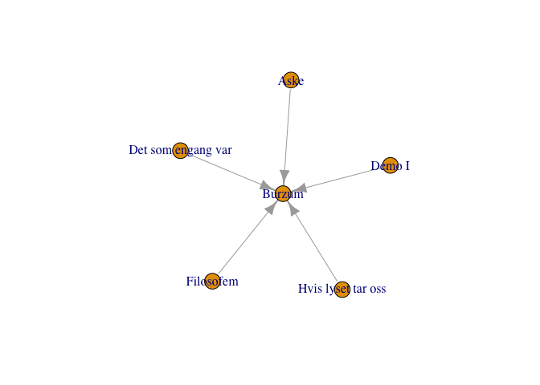

<!-- README.md is generated from README.Rmd. Please edit that file -->

[](https://travis-ci.org/statnmap/neo4r)

[](https://www.tidyverse.org/lifecycle/#experimental)

> Disclaimer: this package is still under active development. Read the
> [NEWS.md](NEWS.md) to be informed of the last changes.

Read complementary documentation at
<https://neo4j-rstats.github.io/user-guide/>

# neo4r

The goal of {neo4r} is to provide a modern and flexible Neo4J driver for
R.

It’s modern in the sense that the results are returned as tibbles
whenever possible, it relies on modern tools, and it is designed to work
with pipes. Our goal is to provide a driver that can be easily
integrated in a data analysis workflow, especially by providing an API
working smoothly with other data analysis (`{dplyr}` or `{purrr}`) and
graph packages (`{igraph}`, `{ggraph}`, `{visNetwork}`…).

It’s flexible in the sense that it is rather unopinionated regarding the
way it returns the results, by trying to stay as close as possible to
the way Neo4J returns data. That way, you have the control over the way
you will compute the results. At the same time, the result is not too
complex, so that the “heavy lifting” of data wrangling is not left to
the user.

The connexion object is also an easy to control R6 method, allowing you
to update and query information from the API.

## Server Connection

Please note that **for now, the connection is only possible through http
/ https**.

## Installation

You can install {neo4r} from GitHub with:

``` r
# install.packages("remotes")
remotes::install_github("neo4j-rstats/neo4r")
```

## Create a connexion object

Start by creating a new connexion object with `neo4j_api$new`

``` r
library(neo4r)
con <- neo4j_api$new(url = "http://localhost:7474", 
                     user = "plop", password = "pouetpouet")
```

This connexion object is designed to interact with the Neo4J API.

It comes with some methods to retrieve information from it :

``` r
# Test the endpoint, that will not work :
con$ping()
#> [1] 401
```

Being an R6 object, `con` is flexible in the sense that you can change
`url`, `user` and `password` at any time:

``` r
con$reset_user("neo4j")
con$reset_password("neo4j") 
con$ping()
#> [1] 200
```

That means you can connect to another url at any time without having to
create a new connexion object. (`con$reset_url()`).

``` r
# Get Neo4J Version
con$get_version()
#> [1] "3.4.5"
# List constaints (if any)
con$get_constraints()
#>         label       type property_keys
#> 1:     artist UNIQUENESS          name
#> 2: Maintainer UNIQUENESS          name
#> 3:       Band UNIQUENESS          name
#> 4:       City UNIQUENESS          name
#> 5:     record UNIQUENESS          name
#> 6:    Package UNIQUENESS          name
#> 7:     Author UNIQUENESS          name
# Get a vector of labels (if any)
con$get_labels()
#> # A tibble: 20 x 1
#>    labels     
#>    <chr>      
#>  1 record     
#>  2 Driver     
#>  3 Engine     
#>  4 Constructor
#>  5 Band       
#>  6 Team       
#>  7 Person     
#>  8 Movie      
#>  9 album      
#> 10 Package    
#> 11 W          
#> 12 Author     
#> 13 City       
#> 14 GrandPrix  
#> 15 E          
#> 16 artist     
#> 17 Test       
#> 18 Playoff    
#> 19 Country    
#> 20 Maintainer
# Get a vector of relationships (if any)
con$get_relationships()
#> # A tibble: 16 x 1
#>    labels        
#>    <chr>         
#>  1 PLAYED_IN     
#>  2 IS_FROM       
#>  3 WAS_RECORDED  
#>  4 WIN           
#>  5 HAS           
#>  6 COUNTRY_ORIGIN
#>  7 BELONGS_TO    
#>  8 BELONGED_TO   
#>  9 FINISHED      
#> 10 has_recorded  
#> 11 ACTED_IN      
#> 12 DIRECTED      
#> 13 PRODUCED      
#> 14 WROTE         
#> 15 FOLLOWS       
#> 16 REVIEWED
# Get schema 
con$get_schema()
#>         label property_keys
#> 1:       Band          name
#> 2:     Author          name
#> 3:     artist          name
#> 4:       City          name
#> 5: Maintainer          name
#> 6:    Package          name
#> 7:     record          name
```

### Using the Connection Pane

`{neo4r}` comes with a Connection Pane interface for RStudio.

Once installed, you can go to the “Connections”, and use the widget to
connect to the Neo4J server:


## Call the API

You can either create a separate query or insert it inside the
`call_neo4j` function.

The `call_neo4j()` function takes several arguments :

  - `query` : the cypher query
  - `con` : the connexion object
  - `type` : “rows” or “graph”: whether to return the results as a list
    of results in tibble, or as a graph object (with `$nodes` and
    `$relationships`)
  - `output` : the output format (R or json)
  - `include_stats` : whether or not to include the stats about the call
  - `meta` : whether or not to include the meta arguments of the nodes
    when calling with “rows”

### “rows” format

The user chooses whether or not to return a list of tibbles when calling
the API. You get as many objects as specified in the RETURN cypher
statement.

``` r
library(magrittr)

'MATCH (r:record) -[:WAS_RECORDED] -> (b:Band) where b.formed = 1991 RETURN *;' %>%
  call_neo4j(con)
#> $b
#> # A tibble: 14 x 2
#>    name     formed
#>    <chr>     <int>
#>  1 Burzum     1991
#>  2 Burzum     1991
#>  3 Burzum     1991
#>  4 Burzum     1991
#>  5 Burzum     1991
#>  6 Burzum     1991
#>  7 Burzum     1991
#>  8 Enslaved   1991
#>  9 Enslaved   1991
#> 10 Enslaved   1991
#> 11 Enslaved   1991
#> 12 Immortal   1991
#> 13 Immortal   1991
#> 14 Immortal   1991
#> 
#> $r
#> # A tibble: 14 x 2
#>    release name                         
#>      <int> <chr>                        
#>  1    1992 Hvis lyset tar oss           
#>  2    1993 Filosofem                    
#>  3    1991 Demo I                       
#>  4    1992 Aske                         
#>  5    1992 Det som engang var           
#>  6    1992 Burzum                       
#>  7    1991 Demo II                      
#>  8    1991 Nema                         
#>  9    1992 Yggdrasill                   
#> 10    1992 Hordanes Land                
#> 11    1993 Vikingligr Veldi             
#> 12    1991 Immortal                     
#> 13    1992 Diabolical Fullmoon Mysticism
#> 14    1993 Pure Holocaust               
#> 
#> attr(,"class")
#> [1] "neo"  "neo"  "list"
```

By default, results are returned as an R list of tibbles. We think this
is the more “truthful” way to implement the outputs regarding Neo4J
calls.

For example, when you want to return two nodes types, you’ll get two
results, in the form of two tibbles (what we’ve seen just before) - the
result is a two elements list with each element being labelled the way
it has been specified in the Cypher query.

Results can also be returned in
JSON:

``` r
'MATCH (r:record) -[:WAS_RECORDED] -> (b:Band) where b.formed = 1991 RETURN * LIMIT 1;' %>%
  call_neo4j(con, output = "json")
#> [
#>   [
#>     {
#>       "row": [
#>         {
#>           "name": ["Burzum"],
#>           "formed": [1991]
#>         },
#>         {
#>           "release": [1992],
#>           "name": ["Hvis lyset tar oss"]
#>         }
#>       ],
#>       "meta": [
#>         {
#>           "id": [12591],
#>           "type": ["node"],
#>           "deleted": [false]
#>         },
#>         {
#>           "id": [13608],
#>           "type": ["node"],
#>           "deleted": [false]
#>         }
#>       ]
#>     }
#>   ]
#> ]
```

If you turn the `type` argument to `"graph"`, you’ll get a graph
result:

``` r
'MATCH (r:record) -[:WAS_RECORDED] -> (b:Band) where b.formed = 1991 RETURN *;' %>%
  call_neo4j(con, type = "graph")
#> $nodes
#> # A tibble: 17 x 3
#>    id    label     properties
#>    <chr> <list>    <list>    
#>  1 13608 <chr [1]> <list [2]>
#>  2 12591 <chr [1]> <list [2]>
#>  3 13613 <chr [1]> <list [2]>
#>  4 13594 <chr [1]> <list [2]>
#>  5 13606 <chr [1]> <list [2]>
#>  6 13600 <chr [1]> <list [2]>
#>  7 13599 <chr [1]> <list [2]>
#>  8 13597 <chr [1]> <list [2]>
#>  9 12595 <chr [1]> <list [2]>
#> 10 13598 <chr [1]> <list [2]>
#> 11 13604 <chr [1]> <list [2]>
#> 12 13610 <chr [1]> <list [2]>
#> 13 13615 <chr [1]> <list [2]>
#> 14 12598 <chr [1]> <list [2]>
#> 15 13596 <chr [1]> <list [2]>
#> 16 13601 <chr [1]> <list [2]>
#> 17 13621 <chr [1]> <list [2]>
#> 
#> attr(,"class")
#> [1] "neo"  "list"
```

The result is returned as one node or relationship by row.

Due to the specific data format of Neo4J, there can be more than one
label and property by node and relationship. That’s why the results is
returned, by design, as a list-dataframe.

We have designed several functions to unnest the output :

\+`unnest_nodes()`, that can unnest a node dataframe
:

``` r
res <- 'MATCH (r:record) -[w:WAS_RECORDED] -> (b:Band) where b.formed = 1991 RETURN *;' %>%
  call_neo4j(con, type = "graph")
unnest_nodes(res$nodes)
#> # A tibble: 17 x 5
#>    id    value  release name                          formed
#>    <chr> <chr>    <int> <chr>                          <int>
#>  1 13608 record    1992 Hvis lyset tar oss                NA
#>  2 12591 Band        NA Burzum                          1991
#>  3 13613 record    1993 Filosofem                         NA
#>  4 13594 record    1991 Demo I                            NA
#>  5 13606 record    1992 Aske                              NA
#>  6 13600 record    1992 Det som engang var                NA
#>  7 13599 record    1992 Burzum                            NA
#>  8 13597 record    1991 Demo II                           NA
#>  9 12595 Band        NA Enslaved                        1991
#> 10 13598 record    1991 Nema                              NA
#> 11 13604 record    1992 Yggdrasill                        NA
#> 12 13610 record    1992 Hordanes Land                     NA
#> 13 13615 record    1993 Vikingligr Veldi                  NA
#> 14 12598 Band        NA Immortal                        1991
#> 15 13596 record    1991 Immortal                          NA
#> 16 13601 record    1992 Diabolical Fullmoon Mysticism     NA
#> 17 13621 record    1993 Pure Holocaust                    NA
```

Please, note that this function will return `NA` for the properties that
aren’t in a node. For example here, we have no ‘licence’ information for
the Maintainer node (that makes sense).

On the long run, and this is not {neo4r} specific but Neo4J related, a
good practice is to have a “name” propertie on each node, so this column
will be full here.

Also, it is possible to unnest either the properties or the labels :

``` r
res$nodes %>%
  unnest_nodes(what = "properties")
#> # A tibble: 17 x 5
#>    id    label     release name                          formed
#>    <chr> <list>      <int> <chr>                          <int>
#>  1 13608 <chr [1]>    1992 Hvis lyset tar oss                NA
#>  2 12591 <chr [1]>      NA Burzum                          1991
#>  3 13613 <chr [1]>    1993 Filosofem                         NA
#>  4 13594 <chr [1]>    1991 Demo I                            NA
#>  5 13606 <chr [1]>    1992 Aske                              NA
#>  6 13600 <chr [1]>    1992 Det som engang var                NA
#>  7 13599 <chr [1]>    1992 Burzum                            NA
#>  8 13597 <chr [1]>    1991 Demo II                           NA
#>  9 12595 <chr [1]>      NA Enslaved                        1991
#> 10 13598 <chr [1]>    1991 Nema                              NA
#> 11 13604 <chr [1]>    1992 Yggdrasill                        NA
#> 12 13610 <chr [1]>    1992 Hordanes Land                     NA
#> 13 13615 <chr [1]>    1993 Vikingligr Veldi                  NA
#> 14 12598 <chr [1]>      NA Immortal                        1991
#> 15 13596 <chr [1]>    1991 Immortal                          NA
#> 16 13601 <chr [1]>    1992 Diabolical Fullmoon Mysticism     NA
#> 17 13621 <chr [1]>    1993 Pure Holocaust                    NA
```

``` r
res$nodes %>%
  unnest_nodes(what = "label")
#> # A tibble: 17 x 3
#>    id    properties value 
#>    <chr> <list>     <chr> 
#>  1 13608 <list [2]> record
#>  2 12591 <list [2]> Band  
#>  3 13613 <list [2]> record
#>  4 13594 <list [2]> record
#>  5 13606 <list [2]> record
#>  6 13600 <list [2]> record
#>  7 13599 <list [2]> record
#>  8 13597 <list [2]> record
#>  9 12595 <list [2]> Band  
#> 10 13598 <list [2]> record
#> 11 13604 <list [2]> record
#> 12 13610 <list [2]> record
#> 13 13615 <list [2]> record
#> 14 12598 <list [2]> Band  
#> 15 13596 <list [2]> record
#> 16 13601 <list [2]> record
#> 17 13621 <list [2]> record
```

  - `unnest_relationships()`

There is only one nested column in the relationship table, thus the
function is quite straightforward :

``` r
unnest_relationships(res$relationships)
#> # A tibble: 14 x 5
#>    id    type         startNode endNode value
#>    <chr> <chr>        <chr>     <chr>   <lgl>
#>  1 21824 WAS_RECORDED 13608     12591   NA   
#>  2 21825 WAS_RECORDED 13613     12591   NA   
#>  3 21819 WAS_RECORDED 13594     12591   NA   
#>  4 21823 WAS_RECORDED 13606     12591   NA   
#>  5 21822 WAS_RECORDED 13600     12591   NA   
#>  6 21821 WAS_RECORDED 13599     12591   NA   
#>  7 21820 WAS_RECORDED 13597     12591   NA   
#>  8 21832 WAS_RECORDED 13598     12595   NA   
#>  9 21833 WAS_RECORDED 13604     12595   NA   
#> 10 21834 WAS_RECORDED 13610     12595   NA   
#> 11 21835 WAS_RECORDED 13615     12595   NA   
#> 12 21829 WAS_RECORDED 13596     12598   NA   
#> 13 21830 WAS_RECORDED 13601     12598   NA   
#> 14 21831 WAS_RECORDED 13621     12598   NA
```

  - `unnest_graph`

This function takes a graph results, and does `unnest_nodes` and
`unnest_relationships`.

``` r
unnest_graph(res)
#> $nodes
#> # A tibble: 17 x 5
#>    id    value  release name                          formed
#>    <chr> <chr>    <int> <chr>                          <int>
#>  1 13608 record    1992 Hvis lyset tar oss                NA
#>  2 12591 Band        NA Burzum                          1991
#>  3 13613 record    1993 Filosofem                         NA
#>  4 13594 record    1991 Demo I                            NA
#>  5 13606 record    1992 Aske                              NA
#>  6 13600 record    1992 Det som engang var                NA
#>  7 13599 record    1992 Burzum                            NA
#>  8 13597 record    1991 Demo II                           NA
#>  9 12595 Band        NA Enslaved                        1991
#> 10 13598 record    1991 Nema                              NA
#> 11 13604 record    1992 Yggdrasill                        NA
#> 12 13610 record    1992 Hordanes Land                     NA
#> 13 13615 record    1993 Vikingligr Veldi                  NA
#> 14 12598 Band        NA Immortal                        1991
#> 15 13596 record    1991 Immortal                          NA
#> 16 13601 record    1992 Diabolical Fullmoon Mysticism     NA
#> 17 13621 record    1993 Pure Holocaust                    NA
#> 
#> $relationships
#> # A tibble: 14 x 5
#>    id    type         startNode endNode value
#>    <chr> <chr>        <chr>     <chr>   <lgl>
#>  1 21824 WAS_RECORDED 13608     12591   NA   
#>  2 21825 WAS_RECORDED 13613     12591   NA   
#>  3 21819 WAS_RECORDED 13594     12591   NA   
#>  4 21823 WAS_RECORDED 13606     12591   NA   
#>  5 21822 WAS_RECORDED 13600     12591   NA   
#>  6 21821 WAS_RECORDED 13599     12591   NA   
#>  7 21820 WAS_RECORDED 13597     12591   NA   
#>  8 21832 WAS_RECORDED 13598     12595   NA   
#>  9 21833 WAS_RECORDED 13604     12595   NA   
#> 10 21834 WAS_RECORDED 13610     12595   NA   
#> 11 21835 WAS_RECORDED 13615     12595   NA   
#> 12 21829 WAS_RECORDED 13596     12598   NA   
#> 13 21830 WAS_RECORDED 13601     12598   NA   
#> 14 21831 WAS_RECORDED 13621     12598   NA   
#> 
#> attr(,"class")
#> [1] "neo"  "list"
```

### Extraction

There are two convenient functions to extract nodes and relationships:

``` r
'MATCH p=()-[r:WAS_RECORDED]->() RETURN p LIMIT 5;' %>%
  call_neo4j(con, type = "graph") %>% 
  extract_nodes()
#> # A tibble: 6 x 3
#>   id    label     properties
#>   <chr> <list>    <list>    
#> 1 13608 <chr [1]> <list [2]>
#> 2 12591 <chr [1]> <list [2]>
#> 3 13613 <chr [1]> <list [2]>
#> 4 13594 <chr [1]> <list [2]>
#> 5 13606 <chr [1]> <list [2]>
#> 6 13600 <chr [1]> <list [2]>
```

``` r
'MATCH p=()-[w:WAS_RECORDED]->() RETURN p LIMIT 5;' %>%
  call_neo4j(con, type = "graph") %>% 
  extract_relationships()
#> # A tibble: 5 x 5
#>   id    type         startNode endNode properties
#>   <chr> <chr>        <chr>     <chr>   <list>    
#> 1 21824 WAS_RECORDED 13608     12591   <list [0]>
#> 2 21825 WAS_RECORDED 13613     12591   <list [0]>
#> 3 21819 WAS_RECORDED 13594     12591   <list [0]>
#> 4 21823 WAS_RECORDED 13606     12591   <list [0]>
#> 5 21822 WAS_RECORDED 13600     12591   <list [0]>
```

## Convert for common graph packages

### {igraph}

In order to be converted into a graph object:

  - nodes need an id, and a name. By default, node name is assumed to be
    found in the “name” property returned by the graph, specifying any
    other column is allowed. The “label” column from Neo4J is renamed
    “group”.

  - relationships need a start and an end, *i.e.* startNode and endNode
    in the Neo4J results.

<!-- end list -->

``` r
'MATCH p=()-[r:WAS_RECORDED]->() RETURN p LIMIT 5;' %>%
  call_neo4j(con, type = "graph") %>%
  convert_to("igraph")
#> IGRAPH f607d94 DN-- 6 5 -- 
#> + attr: name (v/c), value (v/c), release (v/n), formed (v/n), type
#> | (e/c), id (e/c), value (e/l)
#> + edges from f607d94 (vertex names):
#> [1] Hvis lyset tar oss->Burzum Filosofem         ->Burzum
#> [3] Demo I            ->Burzum Aske              ->Burzum
#> [5] Det som engang var->Burzum
```

Which means that you can :

``` r
'MATCH p=()-[r:WAS_RECORDED]->() RETURN p LIMIT 5;' %>%
  call_neo4j(con, type = "graph") %>% 
  convert_to("igraph") %>%
  plot()
```



This can also be used with `{ggraph}` :

``` r
library(ggraph)
#> Loading required package: ggplot2
'MATCH p=()-[r:WAS_RECORDED]->() RETURN p LIMIT 5;' %>%
  call_neo4j(con, type = "graph") %>% 
  convert_to("igraph") %>%
  ggraph() + 
  geom_node_label(aes(label = name)) +
  geom_edge_link() + 
  theme_graph()
#> Using `nicely` as default layout
```


### {visNetwork}

``` r
network <- 'MATCH p=()-[r:WAS_RECORDED]->() RETURN p LIMIT 5;' %>%
  call_neo4j(con, type = "graph") %>% 
  convert_to("visNetwork")
visNetwork::visNetwork(network$nodes, network$relationships)
```

## Sending data to the API

You can simply send queries has we have just seen, by writing the cypher
query and call the api.

### Transform elements to cypher queries

  - `vec_to_cypher()` creates a list :

<!-- end list -->

``` r
vec_to_cypher(iris[1, 1:3], "Species")
#> [1] "(:`Species` {`Sepal.Length`: '5.1', `Sepal.Width`: '3.5', `Petal.Length`: '1.4'})"
```

  - and `vec_to_cypher_with_var()` creates a cypher call starting with a
    variable :

<!-- end list -->

``` r
vec_to_cypher_with_var(iris[1, 1:3], "Species", a)
#> [1] "(a:`Species` {`Sepal.Length`: '5.1', `Sepal.Width`: '3.5', `Petal.Length`: '1.4'})"
```

This can be combined inside a cypher call:

``` r
paste("MERGE", vec_to_cypher(iris[1, 1:3], "Species"))
#> [1] "MERGE (:`Species` {`Sepal.Length`: '5.1', `Sepal.Width`: '3.5', `Petal.Length`: '1.4'})"
```

### Reading and sending a cypher file :

  - `read_cypher` reads a cypher file and returns a tibble of all the
    calls:

<!-- end list -->

``` r
read_cypher("data-raw/create.cypher")
#> # A tibble: 4 x 1
#>   cypher                                                                   
#>   <chr>                                                                    
#> 1 CREATE CONSTRAINT ON (b:Band) ASSERT b.name IS UNIQUE;                   
#> 2 CREATE CONSTRAINT ON (c:City) ASSERT c.name IS UNIQUE;                   
#> 3 CREATE CONSTRAINT ON (r:record) ASSERT r.name IS UNIQUE;                 
#> 4 CREATE (ancient:Band {name: 'Ancient', formed: 1992}), (acturus:Band {na…
```

  - `send_cypher` reads a cypher file, and send it the the API. By
    default, the stats are returned.

<!-- end list -->

``` r
send_cypher("data-raw/constraints.cypher", con)
```

### Sending csv dataframe to Neo4J

The `load_csv` sends an csv from an url to the Neo4J browser.

The args are :

  - `on_load` : the code to execute on load
  - `con` : the connexion object
  - `url` : the url of the csv to send
  - `header` : whether or not the csv has a header
  - `periodic_commit` : the volume for PERIODIC COMMIT
  - `as` : the AS argument for LOAD CSV
  - `format` : the format of the result
  - `include_stats` : whether or not to include the stats
  - `meta` : whether or not to return the meta information

<!-- end list -->

``` r
# Create the constraints
call_neo4j("CREATE CONSTRAINT ON (a:artist) ASSERT a.name IS UNIQUE;", con)
call_neo4j("CREATE CONSTRAINT ON (al:album) ASSERT al.name IS UNIQUE;", con)
```

``` r
# List constaints (if any)
con$get_constraints()
#>         label       type property_keys
#> 1:     artist UNIQUENESS          name
#> 2: Maintainer UNIQUENESS          name
#> 3:       Band UNIQUENESS          name
#> 4:       City UNIQUENESS          name
#> 5:     record UNIQUENESS          name
#> 6:    Package UNIQUENESS          name
#> 7:     Author UNIQUENESS          name
# Create the query that will create the nodes and relationships
on_load_query <- 'MERGE (a:artist { name: csvLine.artist})
MERGE (al:album {name: csvLine.album_name})
MERGE (a) -[:has_recorded] -> (al)  
RETURN a AS artists, al AS albums;'
# Send the csv 
load_csv(url = "https://raw.githubusercontent.com/ThinkR-open/datasets/master/tracks.csv", 
         con = con, header = TRUE, periodic_commit = 50, 
         as = "csvLine", on_load = on_load_query)
#> $artists
#> # A tibble: 2,367 x 1
#>    name           
#>    <chr>          
#>  1 Eminem         
#>  2 Eurythmics     
#>  3 Queen          
#>  4 The Police     
#>  5 A$AP Rocky     
#>  6 Tears For Fears
#>  7 Foals          
#>  8 Bag Raiders    
#>  9 Bright Eyes    
#> 10 Bob Dylan      
#> # … with 2,357 more rows
#> 
#> $albums
#> # A tibble: 2,367 x 1
#>    name                           
#>    <chr>                          
#>  1 Curtain Call (Deluxe)          
#>  2 Sweet Dreams (Are Made Of This)
#>  3 The Game (2011 Remaster)       
#>  4 Synchronicity (Remastered)     
#>  5 LONG.LIVE.A$AP (Deluxe Version)
#>  6 Songs From The Big Chair       
#>  7 Holy Fire                      
#>  8 Bag Raiders (Deluxe)           
#>  9 I'm Wide Awake, It's Morning   
#> 10 Highway 61 Revisited           
#> # … with 2,357 more rows
#> 
#> $stats
#> # A tibble: 12 x 2
#>    type                  value
#>    <chr>                 <dbl>
#>  1 contains_updates          0
#>  2 nodes_created             0
#>  3 nodes_deleted             0
#>  4 properties_set            0
#>  5 relationships_created     0
#>  6 relationship_deleted      0
#>  7 labels_added              0
#>  8 labels_removed            0
#>  9 indexes_added             0
#> 10 indexes_removed           0
#> 11 constraints_added         0
#> 12 constraints_removed       0
#> 
#> attr(,"class")
#> [1] "neo"  "list"
```

## Sandboxing in Docker

You can get an RStudio / Neo4J sandbox with Docker :

    docker pull colinfay/neo4r-docker
    docker run -e PASSWORD=plop -e ROOT=TRUE -d -p 8787:8787 neo4r

## CoC

Please note that this project is released with a [Contributor Code of
Conduct](CODE_OF_CONDUCT.md). By participating in this project you agree
to abide by its terms.
